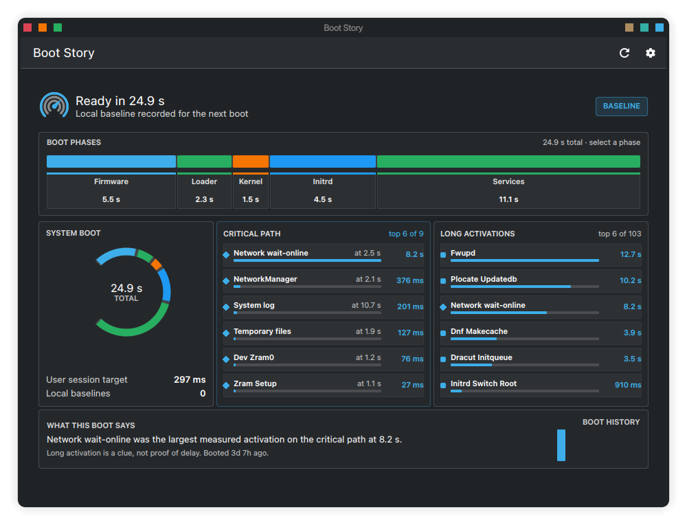
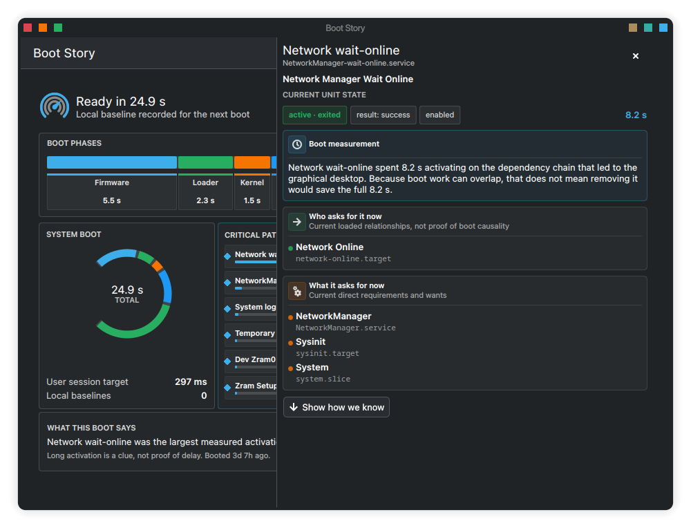

# Boot Story

[](https://github.com/uglyegg/boot-story/actions/workflows/ci.yml)
[](https://store.kde.org/p/2370130)
[](LICENSES/GPL-3.0-or-later.txt)

Boot Story is a native Qt 6 and Kirigami application that turns a systemd boot
into a clear visual story. It shows where startup time went, which dependency
chain determined when the graphical desktop became ready, and which long
activations merely happened alongside it.

<p align="center">
  <a href="docs/images/boot-story-overview.png">
    
  </a>
</p>

## Highlights

- Proportional firmware, bootloader, kernel, initrd, and services timeline
- Actual systemd critical path to `graphical.target`
- Long activations shown separately from causal delay
- Plain-language explanations for every visible unit
- Optional deeper dependency, ordering, unit-file, and result evidence
- Failures limited to those recorded before graphical startup completed
- Private local comparison against up to 20 previous boots
- Compact boot-history graph and human-readable interpretation
- In-app control for automatic one-shot history collection
- Native KDE colors, fonts, icons, controls, and light/dark theme changes
- No polling loop, resident daemon, privileges, or network access

## Installation

Boot Story currently targets:

- Fedora 44 (`.rpm`)
- Ubuntu or Kubuntu 26.04 LTS (`.deb`)

Ubuntu 26.04 is the minimum supported Ubuntu release because Boot Story requires
Qt 6.6 or newer. CI currently builds `x86_64`/`amd64` packages.

Install a downloaded package through the normal package manager:

```sh
sudo dnf install ./boot-story-*.rpm
sudo apt install ./boot-story_*.deb
```

### Build and install from source

Required at runtime:

- Linux with systemd and `systemd-analyze`
- Qt 6.6 or newer
- KDE Kirigami 6 and the KDE Qt Quick Controls style
- Python 3

Building also requires CMake 3.22 or newer, Ninja, the Qt 6 development files,
and the Qt Test development files when running the test suite. Kirigami
development headers are not required because its QML module is loaded at
runtime.

For a local user installation:

```sh
cmake -S . -B build-local -G Ninja \
  -DCMAKE_BUILD_TYPE=RelWithDebInfo \
  -DCMAKE_INSTALL_PREFIX="$HOME/.local" \
  -DBOOT_STORY_SYSTEMD_USER_UNIT_DIR="$HOME/.config/systemd/user"
cmake --build build-local
cmake --install build-local
systemctl --user daemon-reload
```

Boot Story will appear in the KDE application launcher. Make sure
`$HOME/.local/bin` is in `PATH` if you also want to launch it from a terminal.

## Usage

Open Boot Story from the application launcher. The main view separates four
ideas that are easy to confuse in command-line systemd reports:

- **System boot** is the complete startup total reported by `systemd-analyze`.
- **User session** is the user manager's time to `default.target`; background
  services can continue after that target.
- **Critical path** is the dependency chain that determined graphical
  readiness.
- **Long activations** are useful clues, but may have run in parallel and are
  not proof that they delayed the desktop.

Select a boot phase or visible unit to grow the explanation. The first layer is
plain language; **Show how we know** reveals the underlying local systemd
evidence only when requested.

### Deep dive

The unit inspector keeps the boot-time measurement separate from the unit's
current state and loaded relationships, avoiding the common mistake of treating
what is true now as proof of what happened during startup.

<p align="center">
  <a href="docs/images/boot-story-deep-dive.png">
    
  </a>
</p>

Open **Settings** to enable or disable automatic history collection. The switch
controls a delayed user timer directly, so no terminal command is required.
Disabling it keeps history that has already been collected.

“Faster” and “slower” are measured against this machine's local median, never a
universal threshold.

## How it works

The GUI is a small C++ Qt application with a Kirigami QML interface. It launches
the collector asynchronously at startup and when **Refresh** is selected. There
is no polling timer and no resident Boot Story process after the window closes.

The collector runs a fixed set of local, unprivileged `systemd-analyze` and
`systemctl` queries under one collection deadline. Its journal query is limited
to two systemd failure message types, the current boot, and the time when
`graphical.target` became ready. Time, byte, and record limits prevent an
open-ended journal scan.

Selecting an already-visible unit starts one bounded `systemctl show` query.
Boot Story does not enumerate a wall of units and exposes no start, stop,
restart, enable, or disable actions for system services.

Automatic history is optional. A systemd user timer starts one recorder 15
seconds after graphical login; it writes a small summary and exits. History is
size- and schema-bounded and stored privately at
`${XDG_CACHE_HOME:-~/.cache}/boot-story/history.json` with mode `0600`.

## KDE integration

Boot Story uses KDE's Qt Quick Controls style and Kirigami semantic colors and
fonts. It follows the active Plasma light or dark color scheme, Look and Feel
font choices, icon theme, control states, and later theme changes. Its visual
accents describe boot health while remaining derived from the active KDE
palette.

## Development

Run the complete local test suite with:

```sh
make check
```

This runs collector and backend tests, a live snapshot integration test, QML
lint and tests, the C++ build, CTest, AppStream validation, ShellCheck, and a
staged-install inspection.

Build individual package formats with:

```sh
make package-rpm
make package-deb
make package
```

Artifacts and their `SHA256SUMS` manifest are written to `dist/`. Fedora and
Ubuntu packages are built and clean-install tested in their native CI
environments. Tagged releases use an allow-listed signed tag, an offline-signed
manifest, and a guarded draft-publication workflow.

Contributions are welcome. Please read [CONTRIBUTING.md](CONTRIBUTING.md) before
making a major behavioral or visual change.

## Security and privacy

Boot Story performs no network access and requests no privileges. Collection is
local and bounded, history is owner-private, and unit inspection is read-only.
See [SECURITY.md](SECURITY.md) for the security model and private reporting
address.

## License

Boot Story is licensed under
[GPL-3.0-or-later](LICENSES/GPL-3.0-or-later.txt).
